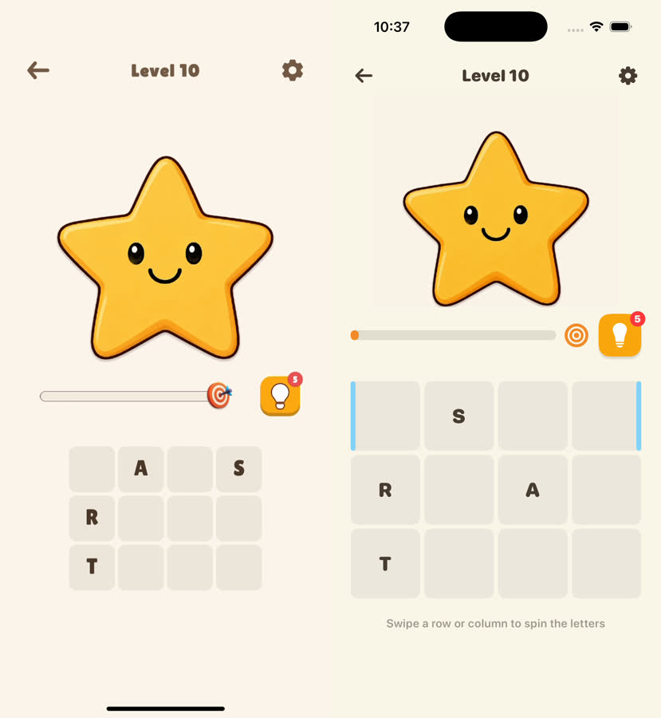
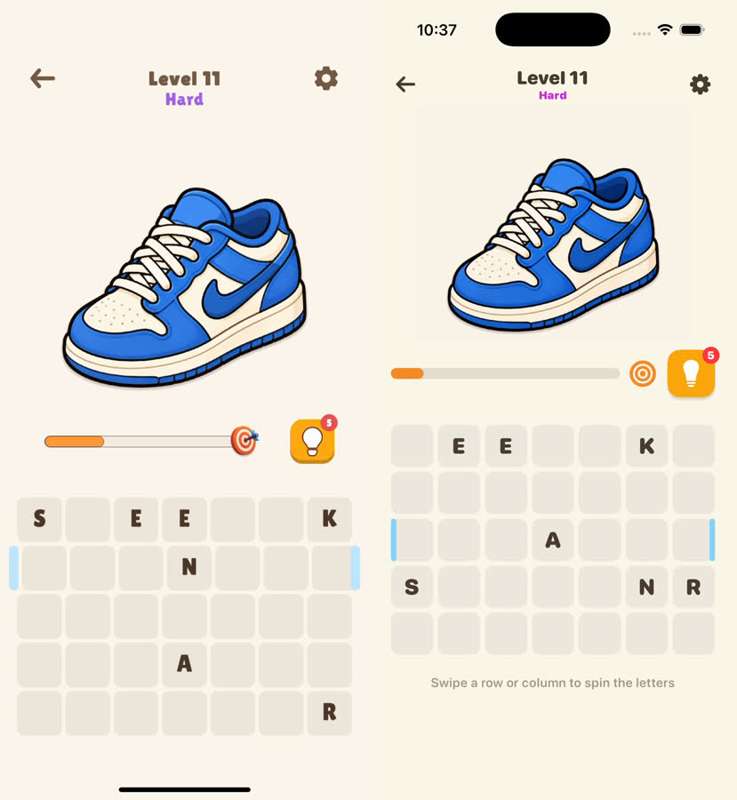
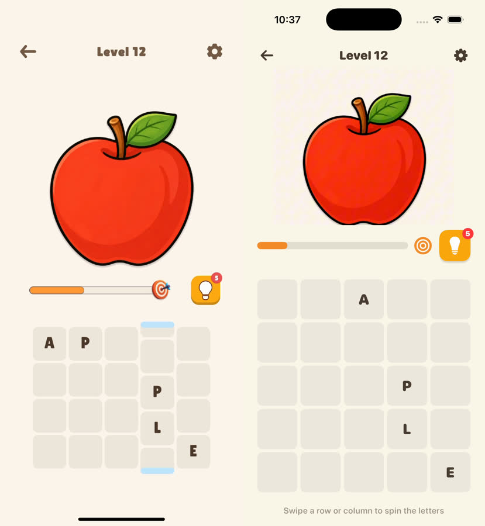

# video-to-ios-game

[English](README.md) | 简体中文

一个用于将游戏玩法视频转换为可配置化 SwiftUI iOS 游戏的 Codex Skill。

## 功能

它会根据一段游戏录屏和一个 Xcode 工程，完成以下工作：

- 分析视频中的游戏玩法、交互方式、界面状态和关卡内容；
- 要求视频至少包含 3 个可实际游玩的关卡；
- 生成一份基于视频证据的需求文档；
- 只在需求文档完成后进行一次确认；
- 确认后实现游戏机制、界面、关卡配置和测试；
- 将关卡内容与游戏逻辑分离，后续新增关卡只需替换配置和合法素材；
- 完成构建、单元测试、UI 测试和模拟器视觉检查。

## 工作流程

1. 检查视频文件和 Xcode 工程。
2. 分析视频，确认至少有 3 个不同的可玩关卡。
3. 生成 `docs/video-to-ios-game-requirements.md` 需求文档。
4. 等待用户确认这份需求文档。
5. 按确认后的文档实现 SwiftUI iOS 游戏。
6. 使用配置化关卡数据接入图片、单词、布局和难度。
7. 执行构建、测试和模拟器视觉检查。
8. 核心游戏完成后，再可选接入 AdMob。

除视频少于 3 个关卡、缺少 Xcode 工程或缺少必要文件等硬阻塞外，流程不会反复询问产品设计问题。视频分析阶段记录观察结果和推断；实现阶段使用可逆的合理假设，并写入需求文档。

## 配置化关卡

默认使用 JSON 作为关卡的标准数据格式，也可以先使用 CSV、XLSX 或其他表格，再转换为标准 JSON。

关卡配置通常包括：

- 关卡 ID；
- 图片或其他线索素材；
- 答案或目标内容；
- 棋盘行列数和初始布局；
- 难度；
- 道具数量；
- 目标位置和玩法参数。

新增普通关卡时，只应修改关卡配置并添加经过授权的素材，不应修改游戏规则或 SwiftUI 视图。详细格式见 [`references/level-schema.md`](references/level-schema.md)。

## AdMob 后置接入

AdMob 不参与视频拆解和核心游戏开发，只有在游戏已经完成并通过基本验证后才接入。

默认支持 3 个广告位：

1. 游戏页底部 Banner，不移动棋盘和主要交互区域；
2. 从第 5 个有序关卡开始，每次成功通关后自动播放插屏广告；
3. 用户主动点击道具时播放 Rewarded Ad，只有完整获得奖励回调后才发放道具。

广告不可用时，游戏仍应正常运行。Debug 使用 Google 测试广告 ID，Release 使用开发者自行配置的正式广告 ID。广告 SDK、隐私同意、ATT、Privacy Manifest 和第三方声明请参考 [`references/admob-postprocess.md`](references/admob-postprocess.md)。

## Example：原版视频到生成结果

[`examples/word-spin/`](examples/word-spin/) 展示了完整流程：以原版游戏录屏作为输入，再以新生成的 iOS Simulator 录屏作为输出。

### 原版输入

[观看 `wordspin.mp4`](examples/word-spin/original-wordspin.mp4)

### 生成的新版本

<video src="https://raw.githubusercontent.com/youxichuhai/video-to-ios-game/main/examples/word-spin/generated-word-spin.mp4" controls width="300"></video>

[打开生成录屏](examples/word-spin/generated-word-spin.mp4)

### 三个关卡对比图

每张图左侧是原版录屏，右侧是生成的 iOS 游戏。

#### Level 10 — STAR



#### Level 11 — SNEAKER



#### Level 12 — APPLE



## 目录结构

```text
video-to-ios-game/
├── SKILL.md
├── README.md
├── README.zh-CN.md
├── examples/
│   └── word-spin/
│       ├── README.md
│       ├── original-wordspin.mp4
│       ├── generated-word-spin.mp4
│       ├── level-10-comparison.jpg
│       ├── level-11-comparison.jpg
│       └── level-12-comparison.jpg
├── agents/
│   └── openai.yaml
└── references/
    ├── admob-postprocess.md
    ├── level-schema.md
    ├── open-source-checklist.md
    └── requirements-spec-template.md
```

## 本地使用

将 `video-to-ios-game` 目录复制到 Codex 的 Skill 目录，或者在本地 Codex 配置中直接引用该目录：

```bash
cp -R video-to-ios-game ~/.codex/skills/
```

使用时需要一个 Xcode 工程和一段游戏录屏。视频分析优先使用 Xcode 命令行工具，以及可用时的 `ffprobe` / `ffmpeg`。

## 开源注意事项

- 不要提交个人路径、用户名、`xcuserdata`、模拟器 ID、密钥或私有服务配置；
- 原始视频、视频截帧和提取出的图片默认不应提交到公开仓库；
- 代码开源许可不等于视频、图片、字体、音频等素材拥有可再分发权；
- 发布前请补充仓库选定的开源许可证和第三方依赖声明；
- 请为所有视频衍生素材记录来源和授权状态。

## 相关文档

- [`SKILL.md`](SKILL.md)：Skill 的完整执行规则；
- [`references/requirements-spec-template.md`](references/requirements-spec-template.md)：需求文档模板；
- [`references/level-schema.md`](references/level-schema.md)：配置化关卡格式；
- [`references/admob-postprocess.md`](references/admob-postprocess.md)：AdMob 后置接入规范；
- [`references/open-source-checklist.md`](references/open-source-checklist.md)：开源发布检查清单。
